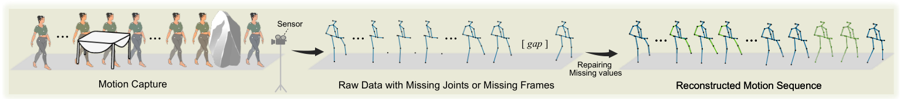
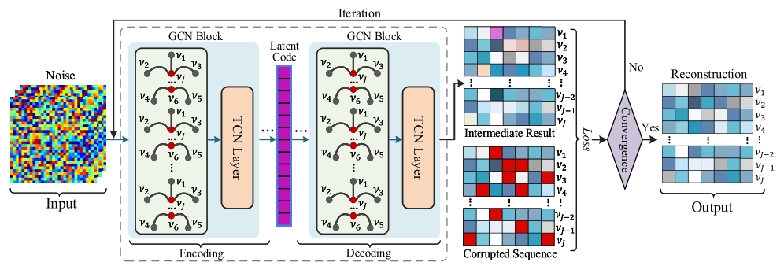
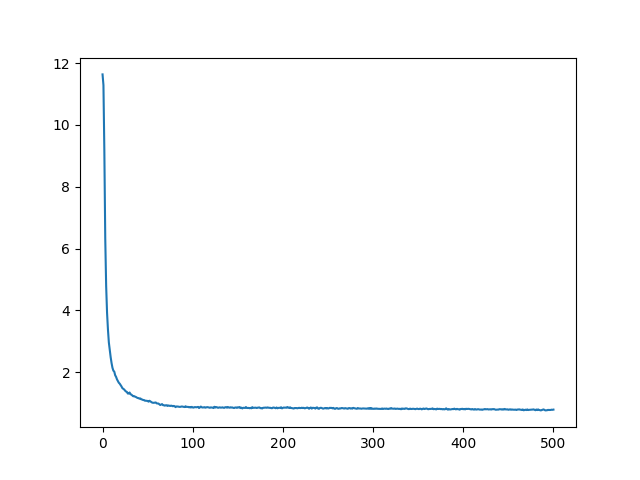

##  Code of the paper "Deep Human Dynamics Prior" in ACM MM 2021.




*Figure 1: In the process of motion capture (mocap), some joints or even the whole human pose may be blocked by objects (e.g., table or stone) in the  environment, leading to the invisibility of the sensor.*

Our model focuses on reconstructing the missing joints/frames in the raw motion capture (mocap) sequence.



​                                             *Figure 2: Model architecture, which is able to obtain the repaired sequence on a single sample.*



​                                                                                                       *Figure 3: Loss curve on 'walking' activity*

Citation using:

```latex
@inproceedings{Cui_2021_DHDP,
author = {Cui, Qiongjie and Sun, Huaijiang and Kong, Yue and Sun, Xiaoning},
title = {Deep Human Dynamics Prior},
year = {2021},
booktitle = {Proceedings of the 29th ACM International Conference on Multimedia (ACM MM)},
pages = {4371–4379},
}
```

